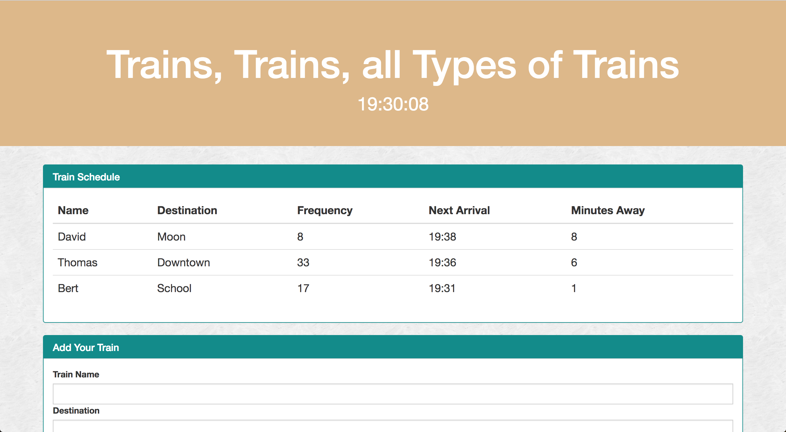

# Train-Schedule

Administrators input starting train data to update users of arrival times and minutes away in real time

Made with JavaScript, jQuery, HTML, CSS, Bootstrap, and FireBase

Url Link: https://davidlatuno.github.io/Train-Schedule/

or click below

